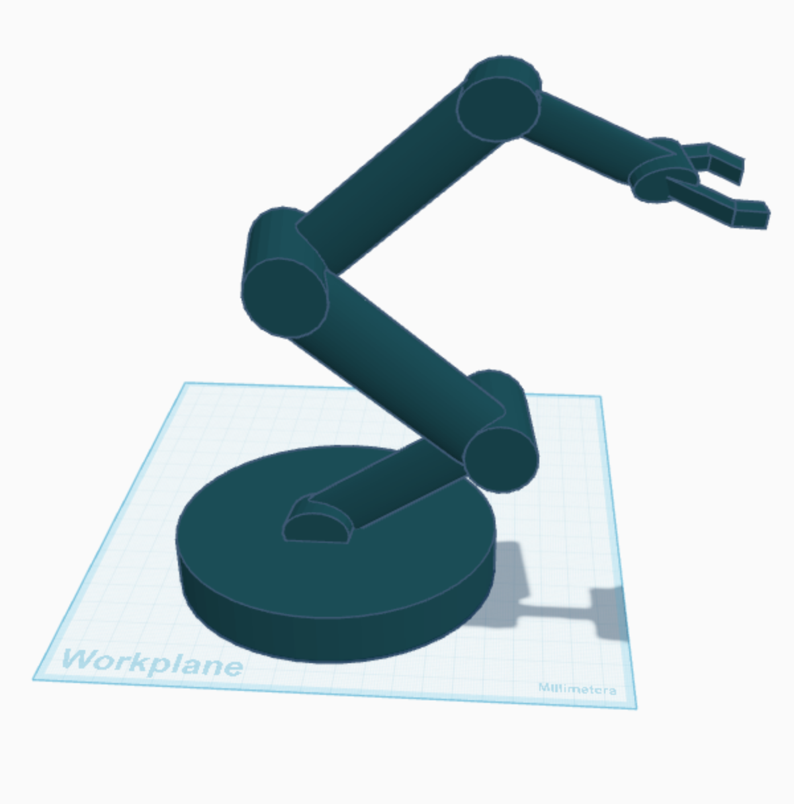
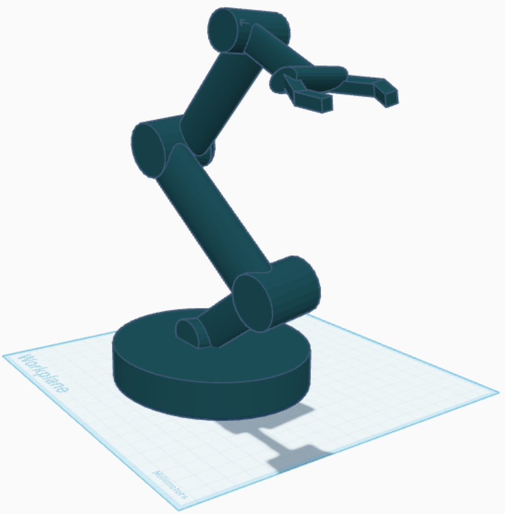

# 5DOF-Robotic-Arm-3D-Design

  

### Project Description

This project features a 3D-designed robotic arm with **5 degrees of freedom (DOF)** created using advanced 3D design software.

The project aims to develop a **3D printable model** for practical applications in educational and industrial robotics sectors.

**Design Optimization:**
- **Accessibility** - Easy to understand and build
- **Cost-effectiveness** - Affordable components and materials
- **Real-world implementation** - Practical applications

This makes it suitable for students, researchers, and robotics enthusiasts.

### Five Degrees of Freedom

  

**🔄 Base Rotation**  
Full 360° rotation around the vertical axis (Z-axis)

**⬆️ Shoulder Joint**  
Vertical lifting and lowering motion of the primary arm

**💪 Elbow Joint**  
Bending and extending motion of the secondary arm segment

**🤲 Wrist Joint**  
Vertical pitch motion for precise positioning

**✋ Gripper Mechanism**  
Open and close functionality for object manipulation
